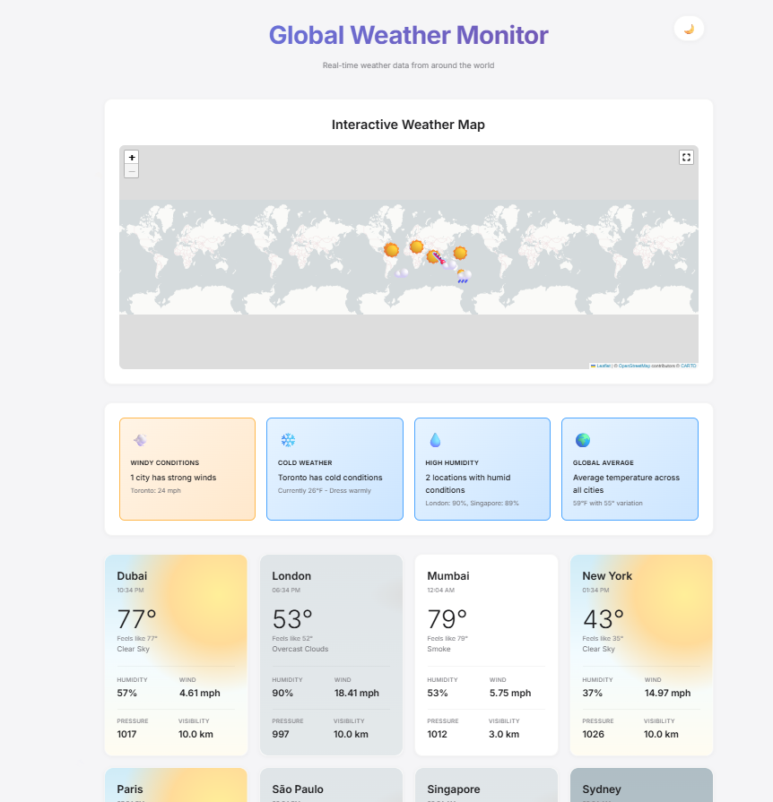
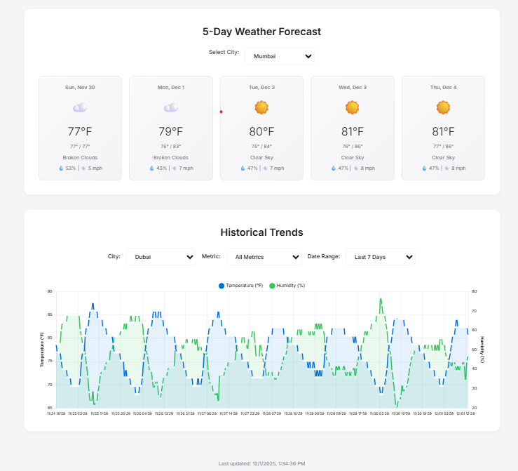

# Weather Trends and Alerts Dashboard

> **Note:** This project is not live anymore.
*For detailed architecture and implementation details, see the [project report](documentation/CC-REPORT.pdf).*

A fully cloud-native weather monitoring application built on AWS, providing real-time weather data collection, forecasting, and automated alerts.

## Architecture

This project leverages multiple AWS services for a serverless, scalable solution:

- **Flask Web App**: Frontend dashboard for visualizing weather trends and forecasts
- **AWS Lambda**: Serverless functions for data collection and forecast processing
- **AWS API Gateway**: RESTful API endpoints
- **AWS S3**: Static asset hosting and data storage
- **AWS CloudWatch**: Automated scheduling and monitoring
- **and more**

## Project Structure
```
├── flask-app/              # Web dashboard application
│   ├── static/            # CSS, JS, and static assets
│   ├── templates/         # HTML templates
│   └── app.py            # Flask application entry point
├── lambda-functions/      # AWS Lambda function code
│   ├── weather-data-collector.py    # Fetches and stores weather data
│   └── weather-forecast-app.py      # Processes forecasts
├── documentation/
│   ├── CC-REPORT.pdf     # Project documentation
│   └── architecture-diagram.png
└── README.md
```

## Features

- Real-time weather data collection and storage
- Weather trend visualization
- Forecast generation and analysis
- Automated alerts based on weather conditions

## Screenshots

### Global Weather Monitor Dashboard

*Interactive weather map displaying real-time weather data from major cities worldwide with automated alerts*

### Weather Forecast and Historical Trends

*weather forecast and historical trend analysis with customizable metrics and date ranges*

## Technologies Used

- **Frontend**: Flask, HTML/CSS, JavaScript
- **Backend**: Python, AWS Lambda
- **Cloud Services**: AWS
- **Weather API**: OpenWeatherMap API

---

